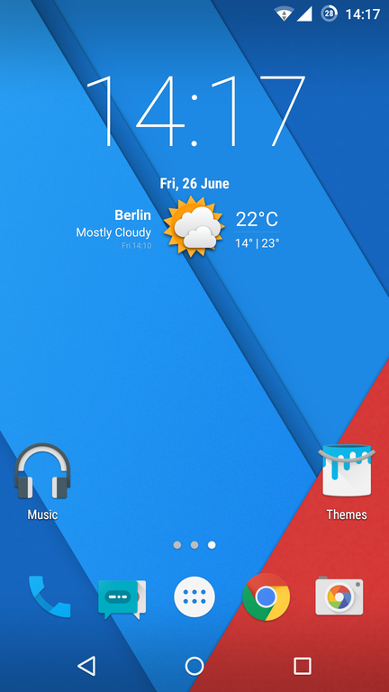

# App-Name

  
Screenshot of CyanogenMod 12 / 12.1 homescreen by Florian838, CC BY-SA 3.0

**TODO:** Kurze Beschreibung der App inklusive der Beschreibung des Problems, welches durch die App gelöst wird. Hier wäre auch ein Screenshot oder Logo zu platzieren.

## Features

**TODO:** Hier die Features (Additional Features) aufzählen und evtl. mit einem Screenshot/Gif demonstrieren o. ä.

## Installation

**TODO:** Beschreibung der durchzuführenden Schritte um die App zu installieren bzw. zum laufen zu bekommen.

1. Repository klonen: `git clone`
2. Android Studio Projekt öffnen
3. Android Studio Projekt bauen
4. Android Studio Projekt im Emulator ausführen oder APK erstellen lassen

## Verwendung der App

**TODO:** Beschreibung der wichtigsten Anwendungsfälle

### Wichtiger Anwendungsfall 1

### Wichtiger Anwendungsfall 2

## Changelog

Die Entwicklungsgeschichte befindet sich in [CHANGELOG.md](CHANGELOG.md).

## Verwendete Bibliotheken

**TODO:** Verwendete Bibliotheken auflisten

## Lizenz

**TODO Lizenz nennen**. Genaue Bedingungen der Lizenz können in [LICENSE](LICENSE) nachgelesen werden.