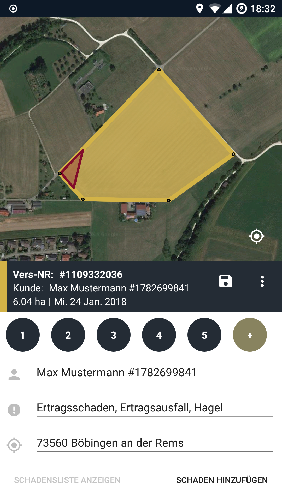

# Prumpo

Für Landwirtinnen und Landwirte, die viele Bodenflächen für den Anbau von
Nutzpflanzen ihr Eigen nennen, sind Schäden auf den Feldern nicht nur lästig,
sondern mitunter auch existenzbedrohend.

Um sich gegen Hagelschäden, Überschwemmungen und Schädlinge abzusichern,
gibt es schon länger die Möglichkeit, Versicherungen abzuschließen.

Die Aufnahme der Schäden, die von den Landwirtinnen und Landwirten gemeldet und von Gutachter*innen erfasst werden,
soll durch diese App erleichtert und beschleunigt werden.

Die App ermöglicht es, Versicherungen & Felder mittels GPS zu erfassen und Schäden darauf zu markieren.
Für den Schadensfall eingeteilte Gutachter können die Schäden nach dem Namen der Versicherungsnehmer filtern
um auch bei vielen Kunden den Überblick zu behalten.

Auch ein Export aller bisherig erfassten Schäden ist möglich.

## Features

### Login
Die App bringt ein Benutzerkontenverwaltungsystem mit. 
Nutzer können einen neuen Account anlegen, einen bestehenden Account nutzen 
oder für Erkundungszwecke einfach nur den Demo-Modus nutzen.

**TODO:** Zwei (hochgeladene Screenshots einbetten)

### Benutzerkontrollzentrum und -customization
Nutzer können einige ihrer Daten (Profilbild, Email und Passwort) im Benutzerkontrollzetrum nach Belieben editieren.
Auch ein Loggout von hieraus ist möglich.

**TODO:** Zwei (hochgeladene Screenshots einbetten)

### Versicherungsverträge exportieren
Angelegte Versicherungsverträge können über die Listenansicht der Versicherungen (erreichbar durch das 
Hamburger-Menu) exportiert werden.

**TODO:** Zwei (hochgeladene Screencasts einbetten)

### Erweiterte Aktionen unter *Weitere Informationen*
Über den Punkt *Weitere Informationen* (erreichbar durch das Hamburger-Menu) können weitere Aktionen initiiert werden.
Diese umfassen sowohl die Möglichkeit, sich per Mail an die Entwickler zu wenden, als auch die Möglichkeit, 
Einsicht in die Lizenzbestimmungen nehmen zu können.

**TODO:** Zwei (hochgeladene Screencasts einbetten)

-->
**TODO:** Weitere (Additional Features) aufzählen und evtl. mit einem Screenshot/Gif demonstrieren o. ä.

## Installation

1. Repository klonen: `git clone`
2. Android Studio Projekt öffnen
3. Android Studio Projekt bauen
4. Android Studio Projekt im Emulator ausführen oder APK erstellen lassen.
5. Die erstellte APK auf das Gerät kopieren.
6. Um die APK zu installieren, müssen *Unbekannte Quellen* zugelassen werden.
Weitere Hinweise können der offiziellen Dokumentation entnommen werden:
Sihe *User opt-in for installing unknown apps* unter https://developer.android.com/distribute/marketing-tools/alternative-distribution.html

## Verwendung der App

Um einen Schadensfall anzulegen, **muss zuerst eine Versicherung angelegt werden**. 

**Die notwendigen Schritte sind mindestens:**
1. Versicherung anlegen und speichern.
2. Schadensfall hinzufügen.

### Versicherung anlegen
1. Die App starten und falls noch nicht gemacht einloggen.
2. Im Navigation Drawer den Punkt *Versicherungen* auswählen (erreichbar durch das Hamburger-Menu).
3. In der Toolbar auf das Plus (*Hinzufügen*) drücken. 

Die Karte wird nun angezeigt und die Erfassung kann beginnen.
Um eine Versicherung speichern zu können, *müssen* die folgenden Kriterien erfüllt sein:
- Es muss eine Fläche (also mindestens drei Eckpunkte) eingetragen sein. *Erst danach können weitere Meta-Daten 
erfasst werden*
- Es wurde ein im System bestehender Kunde eingetragen (Beim Eingeben des Kundennamen werden alle passenden Kunden 
angezeigt, aus dem einer ausgewählt werden muss)
- Es muss mindestens eine Versicherungsart ausgewählt worden sein
- Es muss ein Ort eingetragen sein

### Schädensfall erfassen
1. Die App starten und falls noch nicht gemacht einloggen.
2. Eine zuvor angelegte Versicherung zum Beispiel über *Versicherungen* (im Hamburger-Menu) auswählen.
3. Im sich ausfahrenden Dialog auf *Schaden hinzufügen* drücken.

Ein neuer Dialog wird nun angezeigt und die Erfassung kann beginnen.
Um einen Schadensfall speichern zu können, *müssen* die folgenden Kriterien erfüllt sein:
- Es muss eine Fläche (also mindestens drei Eckpunkte) eingetragen sein. *Erst danach können weitere Meta-Daten 
erfasst werden*
- Es muss ein Datum eingetragen sein

**TODO:** Weitere kritische Anwendungsfälle beschreiben

## Changelog

Die Entwicklungsgeschichte befindet sich in [CHANGELOG.md](CHANGELOG.md).

## Verwendete Bibliotheken

Android Support
* android support preference-v7 v26.1.0
* android support appcompat-v7 v26.1.0
* android support constraint constraint-layout v1.0.2
* android support design v26.1.0
* android support cardview-v7 v26.1.0
* android support recyclerview-v7 v26.1.0

Arch lifecycle
* android arch persistence room runtime v1.0.0
* android arch lifecycle extensions v1.0.0
* android arch lifecycle runtime v1.0.0
* android arch persistence room compiler v1.0.0  
* android arch lifecycle compiler v1.0.0

Butterknife
* jakewharton butterknife v8.8.1  
* jakewharton butterknife-compiler v8.8.1

Dagger
* google dagger dagger v2.13
* google dagger dagger-android v2.13
* google dagger dagger-android-support v2.13  
* google dagger dagger-android-processor v2.13  
* google dagger dagger-compiler v2.13

Sonstige
* greenrobot eventbus v3.1.1
* android gms play-services-maps v11.6.2
* google code gson gson v2.8.2
* joda-time joda-time v2.9.9

## Lizenz

Apache License 2.0

Genaue Bedingungen der Lizenz können in [LICENSE](LICENSE) nachgelesen werden.