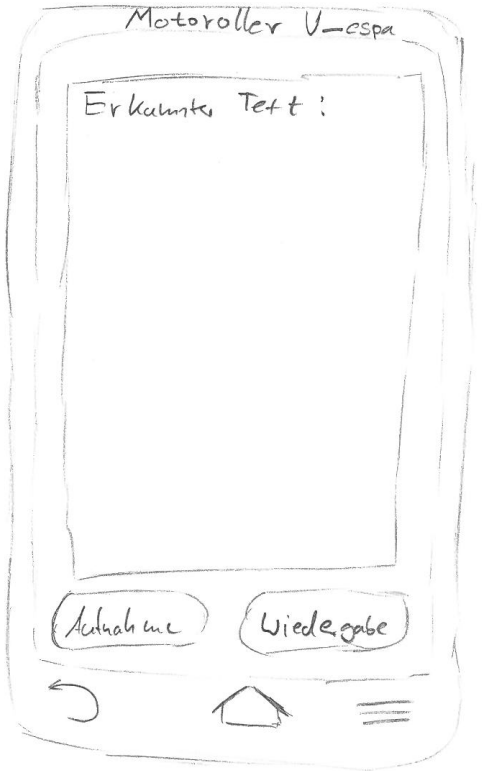

# Einführung

*Dieser Entwurf legt die prinzipielle Lösungsstruktur fest und enthält alles, was man benötigt, um einem Außenstehenden den prinzipiellen Aufbau der App erklären zu können.* (**keep it simple**)

**TODO:** Beschreibung des grundlegenden Aufbaus.

**TODO:** Verweis auf Standards wie zum Beispiel verwendete Entwurfsmuster o.ä.

# Komponentendiagramm

![Gubaer at the German language Wikipedia [GFDL (http://www.gnu.org/copyleft/fdl.html) or CC-BY-SA-3.0 (http://creativecommons.org/licenses/by-sa/3.0/)], via Wikimedia Commons](images/Komponentendiagramm.png)

Gubaer at the German language Wikipedia [GFDL (http://www.gnu.org/copyleft/fdl.html) or CC-BY-SA-3.0 (http://creativecommons.org/licenses/by-sa/3.0/)], via Wikimedia Commons.

**TODO:** Komponentendiagramm der eigenen und externen Komponenten der App erstellen.

## Komponente 1

**TODO:** Beschreibung der Komponente inklusive seiner verwendeten und bereitgestellten Schnittstellen

## Komponente 2

**TODO:** Beschreibung der Komponente inklusive seiner verwendeten und bereitgestellten Schnittstellen

## Externe Komponente 1

**TODO:** Beschreibung der **externen** Komponente/Bibliothek und wie diese verwendet werden soll.

# Klassendiagramm

![Gubaer at the German language Wikipedia [GFDL (http://www.gnu.org/copyleft/fdl.html) or CC-BY-SA-3.0 (http://creativecommons.org/licenses/by-sa/3.0/)], via Wikimedia Commons](images/Klassendiagramm.png)

Gubaer at the German language Wikipedia [GFDL (http://www.gnu.org/copyleft/fdl.html) or CC-BY-SA-3.0 (http://creativecommons.org/licenses/by-sa/3.0/)], via Wikimedia Commons

**TODO:** Klassendiagramm der Aufteilung der eigenen Komponenten in Klassen darstellen.

## Beschreibung der wichtigen Klassenhierarchie 1

**TODO:** Die wichtigen Klassen und ihre Hierarchie beschreiben.

## Beschreibung der wichtigen Klasse 2

## Beschreibung der wichtigen Klasse 3

# GUI-Skizze

GUI-Skizze von Jan-Peter Ostberg, CC-BY-SA 4.0

**TODO:** Eigene möglichst handschriftliche GUI-Skizzen erstellen und beschreiben.