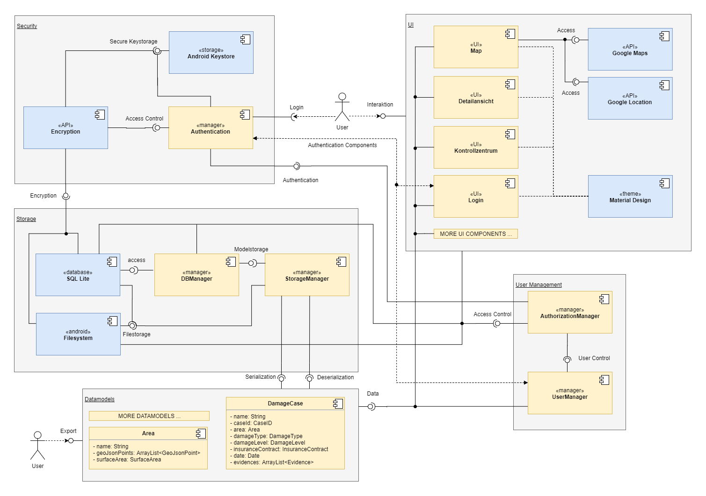
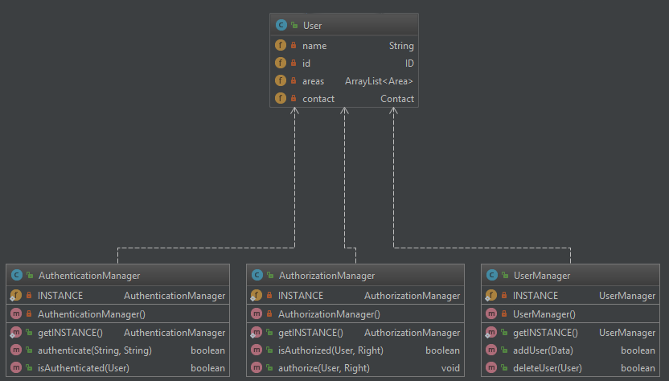
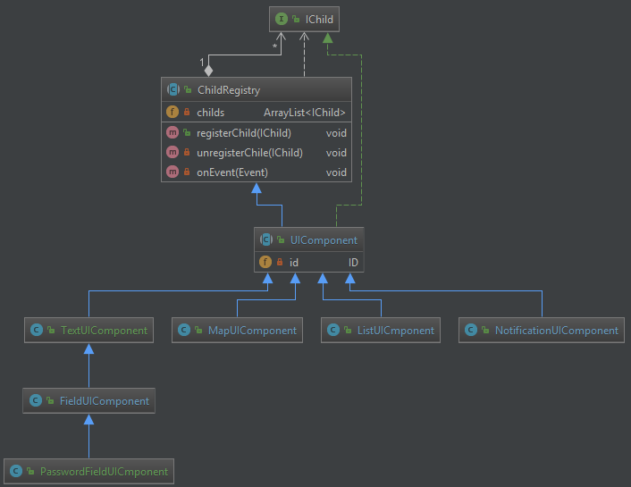
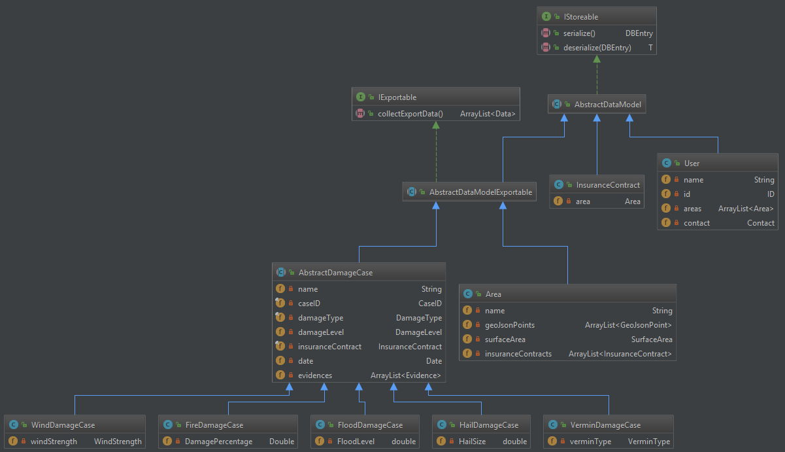

# Einführung

Die App besteht aus den fünf grundlegenden Komponenten **Security**, **Storage**, **Datamodels**, **User Management** und **UI**. Die Verknüpfungen der Komponenten und ihrer Schnittstellen sind im Komponentendiagram visualisiert.

Auswahl verwendete Entwurfsmuster und Standards 
- Singleton
- Observer Pattern
- Decorator Pattern
- Composite Pattern
- SOLID (https://en.wikipedia.org/wiki/SOLID_(object-oriented_design))
- KISS (https://de.wikipedia.org/wiki/KISS-Prinzip)

# Komponentendiagram

Die bereits genannten grundlegenden Komponenten werden nachfolgend näher beschrieben:

## Security

>Diese Komponente stellt sicher, dass der User eingeloggt ist und all seine Daten sicher gespeichert werden. *Security* stellt lediglich eine Schnittstelle zu Verschlüsseling und Authentifizierung  bereit. Die eigentlichen Autorisierung findet an anderer Stelle statt.

### Authentication
Hier wird eine Login-Schnittstelle mit den anderen *Authetication Components* bereitgestellt. Der User kann sich im *Login UI* mit den vom *User Manager* breitgestellten Daten anmelden.

### Android Keystore (extern)
Der Android Keystore stellt eine Schnittstelle bereit, um die für die Verschlüsselung und Authentifizierung benötigten sensiblen Daten zu speichern.

### Encryption (extern)
Eine externe Verschlüsselungsbibliothek wird verwendet um die eigentliche Verschlüsselung zu gewährleisten. Es wird dabei auf eine ausgereifte Verschlüsselungstechnik zurückgegriffen. 

## Storage

>Hier wird eine Schnittstelle breitgestellt, um alle Daten dauerhaft auf dem Gerät speichern zu können. Die Daten werden automatisch zwischen den *Datamodels* und den dazugehörigen Einträgen in der Datenbank über die Serialisierungsschnittstellen synchronisiert. Die sensiblen Dateien werden dabei von der Verschlüsselungsschnittstelle verschlüsselt und anschließend in der Datenbank abgelegt. Falls es sich um eine Foto etc. handelt, wird nur ein Verweis auf die im *Filesystem* gespeicherte Datei in der Datenbank hinterlegt.

### DBManager
Hier werden alle Schreib- und Lesevorgänge an die Datenbank kontrolliert. Es muss dabei vom *AuthorizationManager* sichergestellt werden, dass der User ausreichend Rechte hat.

### StorageManager
Der StorageManager interagiert mit den einzelnen *Datamodels* um sicherzustellen, dass die Daten im Anwendungsspeicher und in der Datenbank identisch sind. Somit kann garantiert werden, dass im Fall eines App-Absturzes trotzdem noch alle Daten vorhanden sind. 

### SQL Lite (extern)
Eine Datenbank ([SQL Lite](https://developer.android.com/training/data-storage/room/index.html)) wird verwendet, um die Möglichkeit zu haben die Daten mithilfe einer Querry schon sortiert oder nur in gewünschter Anzahl zu bekommen. Es wird bewusst darauf verzichtet, die Daten in normalen Textdateien zu speichern, um eine höhere Kontrolle über den Datenfluss zu haben.

### Filesytem (extern)
Im *Filesystem* werden Dateien wie Bilder und andere große Dateien abgelegt. Über die Encryption-Schnittstelle wird garantiert, dass es keinen unberechtigten Zugriff auf diese Dateien gibt. Die Pfade und Dateinamen werden in der Datenbank hinterlegt.

## UI

>Das UI ist die Schnittstelle zwischen Benutzer und der darunterliegenden Businesslogik. Der Benutzer navigiert mithilfe der UI-Elemente in der App und kann gewünschte Aktionen (z.B. Schadensfälle hinzufügen) aufrufen und durchführen. Androidtypsich wird [*Material Design*](https://material.io/) als Designsprache verwendet.

### Map
Das Map UI ist der Ausgangspunkt zum Hinzufügen von Feldern und die Main-View der App, die nach einem erfolgreichen Einloggen aufgerufen wird. Die Visualisierung und Bearbeitung bereits hinzugefügter Felder wird ebenfalls von hier gestartet.

### Detailansicht
Die Detailansicht beschreibt die Ansicht **beim** Hinzufügen und Editieren von Feldern. Die Detailansicht kann nicht versehentlich verlassen werden. Der Benutzer muss das Hinzufügen/Editieren willentlich abbrechen oder erfolgreich abschließen.

### Kontrollzentrum
Das Benutzerkontrollzentrum ist für den Benutzer über die Sidebar zu erreichen und zeigt Informationen zum aktuell eingeloggten Benutzer an. Das sind sowohl nicht editierbare Informationen wie die Benutzerrolle als auch Informationen, die vom Benutzer geändert werden können.

### Login
Der Login-Screen ist beim erstmaligen Benutzen der App der erste Screen, den ein Benutzer zu sehen bekommt. Verlangt werden nur Benutzername und Passwort. Hat der sich einloggende Benutzer die Checkbox zum *Erinnern der Benutzerdaten* gesetzt, wird der Loginscreen beim nächsten Start der Anwendung übersprungen.

### Material Design (extern)
Die Anwendung hält sich an die von Google vorgegebenen Designrichtlinien und verwendet [*Material Design*](https://material.io/) als Designsprache.

### Google Maps (extern)
Zum Visualisieren der Umgebung aber auch der einzutragenden Schäden wird die externe Map-Bibliothek von Google ([Google Maps](https://developers.google.com/maps/android/?hl=de)) verwendet. Zoom-Gesten und verschiedene Ansichten (Satelliten- und Kartenansicht) werden mitgeliefert und können bei Bedarf eingebunden werden.

### Google Location (extern)
Die Google-Location-API stellt Funktionen und Klassen bereit, um eine Standortermittlung mit höherer Präzision durchzuführen. Standortzugriffe über GPS, WLAN und Mobilfunkdaten werden unterstützt und für die Positionserfassung des Benutzers benötigt.

## User Management

> Die Komponente *User Management* kontrolliert die Zugriffsrechte von sich einloggenden Benutzern. Dafür interagiert sie mit dem *DBManager* aus der *Storage*-Komponente.

### AuthorizationManager
Der AuthorizationManager stellt sicher, dass der User nur Aktionen ausführen kann, die für seine Benutzerrolle zugelassen sind. Ein Landwirt kann zum Beispiel nicht ohne Weiteres seine versicherten Flächen anpassen, ein Gutachter dagegen schon.

### UserManager
Der UserManager verwaltet die Benutzer, sowie dessen Berechtigungen  und Rollen. Über ein *DataModel* werden diese Informationen dann sicher in der Datenbank verwahrt.

## Datamodels

Datamodels beschreiben die Klassen und Objekte der App, welche persistent in einer Datenbank gehalten werden sollen. Mithilfe dieser Klassen werden Informationen in der UI angezeigt. Welche Daten angezeigt werden, hängt unter anderem vom aktuell eingeloggten Benutzer und dessen Rolle ab.
Jedes für den Benutzer relevante Model hat ebenfalls die Möglichkeit, es zu exportieren.

# Klassendiagramm

Nachfolgend werden einige der internen Komponenten näher beschrieben.

Alle Manager verwenden hier das Singleton-Pattern um zu gewährleisten, dass es keine Duplikate der einzelnen Manager geben kann. Damit lässt sich die Zugriffskontrolle kontrollieren. Einige Mananger erlauben Laziness, wodurch die Komponenten erst zur Nutzung initialisiert werden.

Die *UI Komponenten* verwenden das *Composite* Pattern, wessen Komponenten sich durch *Observer* synchronisieren. Es handelt sich hierbei mehr um eine sehr abstrahierte Demonstration des in Android verwendeten Patterns. Einige UI Komponenten wie z.B. ein Textfeld sind hierbei natürlich schon bei Android standardmäßig dabei, in einigen Views jedoch, wie z.B. der Map werden aber eigene maßgeschneiderte Komponenten verwendet.

Die abstrakte Klasse *AbstractDataModel* definiert eine Oberklasse, von der alle anderen *DataModels* erben. Alle *DataModel*-Klassen müssen die Eigenschaft aufweisen, dass sie in die Datenbank geschrieben werden können, wofür die Schnittstelle *IStorable* definiert wird. Einige DataModels wie zum Beispiel die Klassen, die AbstractDamageCase implementieren, sollen zudem exportierbar sein, wofür das *IExportable*-Interface zuständig ist.

# GUI-Skizze

Um einen möglichst realistischen Entwurf präsentieren zu können, unter dem sich vor allem der Kunde gut vorstellen kann, wie seine App im Endstadium aussieht, haben wir uns dazu entschieden die Software [Adobe XD](https://www.adobe.com/de/products/xd.html) zu verwenden. 

### Login GUI
Sobald die App gestartet wird, erwartet den Benutzer ein Login-Screen (vgl. Screenshot). Der Benutzer gibt seine Zugangsdaten ein, und wird entsprechend seiner Benutzerrolle erkannt.

### Map GUI
Nach erfolgreichem Login findet sich der Benutzer auf der Hauptansicht (Karte) wieder. Von hier aus werden alle weiteren Aktionen gestartet. Die Schaltfläche oben links öffnet das Sidebar GUI.
Die Hauptansicht (Karte) bietet abseits des Menüs und einer Suchleiste oben auch zwei Schaltflächen unten rechts. Mit dem ersten Button lässt sich die Karte auf der aktuellen Position zentrieren während der zweite Button die Erfassung eines neuen Feldes startet.

### Schadensfälle Listen GUI
Über dieses Menü bekommt der Benutzer eine Übersicht über alle seine Schadensfälle. Durch den Klick auf eines der Schadenfälle wird dem User die Detail-Ansicht zu dem Schadensfall geöffnet.

### Sidebar GUI
Über die Sidebar oben links kann der Benutzer sein Profil aufrufen, Schadensfälle, Versicherungsflächen und Verträge einsehen und weitere Einstellungen vornehmen.

### Hinzufügen con Schadensfällen GUI
Die Felderfassung beginnt damit, dass an der aktuellen Position des Nutzers ein Marker auf der Karte erscheint und ein Menü für das aktuelle Feld von unten animiert eingeblendet wird. Über das Menü werden Daten zum Feld, zum Beispiel Art des Feldes (Felder des Landwirts, Schadensflächen, Versicherungsflächen (Admin)) und deren Metadaten eingegeben. Ab drei hinzugefügten Markern auf der Karte kann der Benutzer ein Feld speichern, sofern alle benötigten Daten eingegeben wurden.

