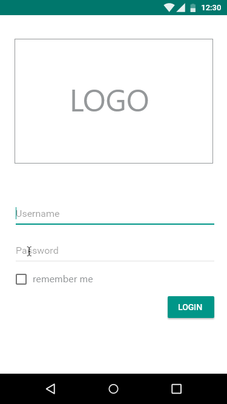
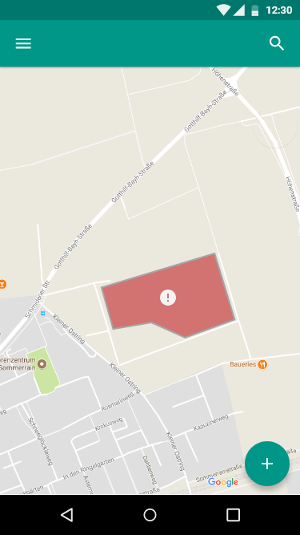
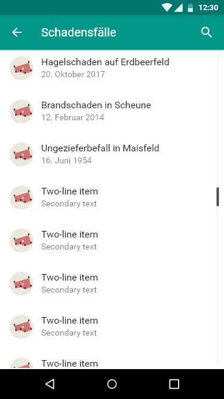
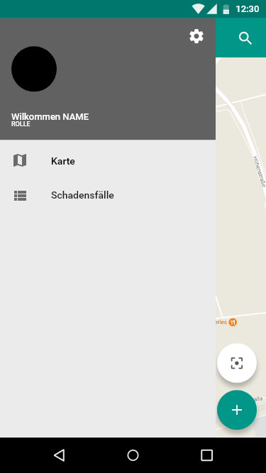
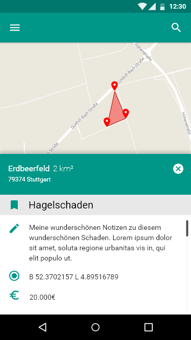

# Einführung

*Dieser Entwurf legt die prinzipielle Lösungsstruktur fest und enthält alles, was man benötigt, um einem Außenstehenden den prinzipiellen Aufbau der App erklären zu können.* (**keep it simple**)

**TODO:** Verweis auf Standards wie zum Beispiel verwendete Entwurfsmuster o.ä.

Immer an SOLID halten! (Link) [https://en.wikipedia.org/wiki/SOLID_(object-oriented_design]

# Komponentendiagram

![Gubaer at the German language Wikipedia [GFDL (http://www.gnu.org/copyleft/fdl.html) or CC-BY-SA-3.0 (http://creativecommons.org/licenses/by-sa/3.0/)], via Wikimedia Commons](images/Komponentendiagramm.png)

Gubaer at the German language Wikipedia [GFDL (http://www.gnu.org/copyleft/fdl.html) or CC-BY-SA-3.0 (http://creativecommons.org/licenses/by-sa/3.0/)], via Wikimedia Commons.

**TODO:** Komponentendiagramm der eigenen und externen Komponenten der App erstellen.

## Komponente 1

**TODO:** Beschreibung der Komponente inklusive seiner verwendeten und bereitgestellten Schnittstellen

## Komponente 2

**TODO:** Beschreibung der Komponente inklusive seiner verwendeten und bereitgestellten Schnittstellen

## Externe Komponente 1

**TODO:** Beschreibung der **externen** Komponente/Bibliothek und wie diese verwendet werden soll.

# Klassendiagramm

![Gubaer at the German language Wikipedia [GFDL (http://www.gnu.org/copyleft/fdl.html) or CC-BY-SA-3.0 (http://creativecommons.org/licenses/by-sa/3.0/)], via Wikimedia Commons](images/Klassendiagramm.png)

Gubaer at the German language Wikipedia [GFDL (http://www.gnu.org/copyleft/fdl.html) or CC-BY-SA-3.0 (http://creativecommons.org/licenses/by-sa/3.0/)], via Wikimedia Commons

**TODO:** Klassendiagramm der Aufteilung der eigenen Komponenten in Klassen darstellen.

## Beschreibung der wichtigen Klassenhierarchie 1

**TODO:** Die wichtigen Klassen und ihre Hierarchie beschreiben.

## Beschreibung der wichtigen Klasse 2

## Beschreibung der wichtigen Klasse 3

# GUI-Skizze

Um einen möglichst realistischen Entwuf präsentieren zu können, unter dem sich vor allem der Kunde gut vorstellen kann, wie seine App im Endstadium aussieht, haben wir uns dazu entschieden die Software [Adobe XD](https://www.adobe.com/de/products/xd.html) zu verwenden. 

### Login GUI
Sobald die App gestartet wird, erwartet den Benutzer ein Login-Screen (vgl. Screenshot). Der Benutzer gibt seine Zugangsdaten ein, und wird entsprechend seiner Benutzerrolle erkannt.

### Map GUI
Nach erfolgreichem Login findet sich der Benutzer auf der Hauptansicht (Karte) wieder. Von hier aus werden alle weiteren Aktionen gestartet. Die Schaltfläche oben links öffnet das Sidebar GUI.
Die Hauptansicht (Karte) bietet abseits des Menüs und einer Suchleiste oben auch zwei Schaltflächen unten rechts. Mit dem ersten Button lässt sich die Karte auf der aktuellen Position zentrieren während der zweite Button die Erfassung eines neuen Feldes startet.

### Schadensfälle Listen GUI
Über diese Menü bekommt der Banutzer eine Übersicht über alle seine Schadensfälle. Durch den Klick auf eines der Schadenfälle wird dem User die Detail-Ansicht zu dem Schadensfall geöffnet.

### Sidebar GUI
Über die Sidebar oben links kann der Benutzer sein Profil aufrufen, Schadensfälle, Versicherungsflächen und Verträge einsehen und weitere Einstellungen vornehmen.

### Hinzufügen con Schadensfällen GUI
Die Felderfassung beginnt damit, dass an der aktuellen Position des Nutzers  ein Marker auf der Karte erscheint und ein Menü für das aktuelle Feld von unten animiert eingeblendet wird. Über das Menü werden Daten zum Feld, zum Beispiel Art des Feldes (Felder des Landwirts, Schadensflächen, Versicherungsflächen (Admin)) und deren Metadaten eingegeben. Ab drei hinzugefügten Markern auf der Karte kann der Benutzer ein Feld speichern, sofern alle Mandatory-Daten eingegeben wurden.

